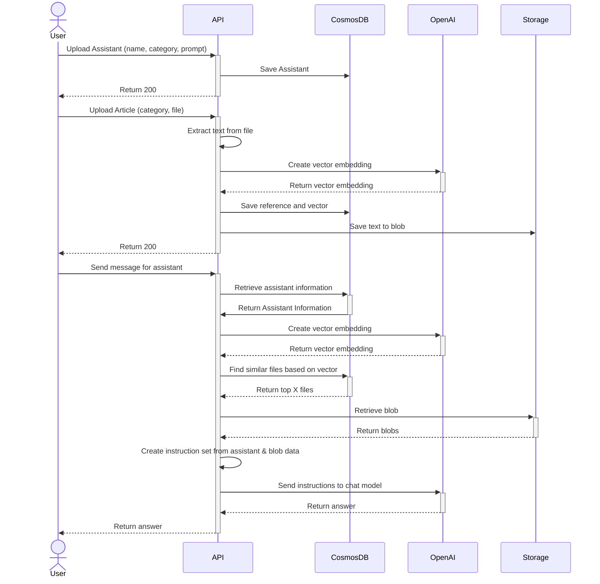

# All Purpose RAG Chat

## Overview

At the core of this solution is an API allowing users to create an AI assisted conversation on any topic and with any instructions. The API gives the capability to users (you!) to create specialized AI assistants that each have their own instruction set and knowledge base on a specific topic. For any topic knowledge can be uploaded in the form of a file to further enhance the expertise of the assistants allowing users to ask about specific knowledge. During the conversation the assistant will remain aware of the last few messages including the knowledge used allowing users to continue asking questions. Conversations are persisted allowing you to pick up right where you left off, even days later.

The API is a full Azure cloud-based application that comes with infrastructure and deployment scripts. Its easy to use API operations it's capable of allowing developer throughout an organisation to quickly implement RAG-based chat features using their own knowledge base without requiring deeper knowledge of its implementation.

The solution also contains a sample web application in the form of a single page application allowing easy user access to start a conversation with any of the available assistants.

### How it works

Below is a simplified diagram illustrating the app's core workflow:



## Setup Azure OpenAI

At its core the API leverages Azure OpenAi for it's AI related tasks. To do so an Azure OpenAi resource should be setup with the following additions:

1. Create the Azure OpenAi resource (keep note some options may only be available in some regions)
2. Go to the Azure AI Studio to setup the following steps
3. Create a deployment model for any text embedding and note the name
    * e.g. `text-embedding-large`
4. Create a deployment model for any GPT model 
    * e.g. `chat-gpt-4o mini`
5. Create an assistant using the deployment model and note the id

## Run Locally

The API relies on several Azure resources in order to run. These can be created using by running the `iac/main.bicep` file using the `az deployment group create` command from the Azure CLI.

For the API create a `local.appsettings.json` in `src/api/RagChatApi` using the following format:

```json
{
  "IsEncrypted": false,
  "Values": {
    "AzureWebJobsStorage": "UseDevelopmentStorage=true",
    "FUNCTIONS_WORKER_RUNTIME": "dotnet-isolated",
    "Cosmos:Uri": "<the endpoint from the cosmosdb>",
    "Cosmos:Key": "<the access key from the cosmosdb>",
    "OpenAi:Uri": "<the uri from the azure openai instance>",
    "OpenAi:Key": "<the access key from the azure openai instance>",
    "OpenAi:Assistant": "<the id of the assistant>",
    "OpenAi:Embedding": "<the deployment name of the embedding>",
    "AzureStorage:ConnectionString": "<the connection string to the azure storage>"
  },
  "Host": {
    "CORS": "*"
  }
}
```

To run the Single Page Application create a `.env.local` file in `src/spa` using the following format:

```
# base uri may be adjusted to local instance
VITE_API_BASEURI=http://localhost:7286/api
VITE_API_KEY=''
```

## Workflow setup

To deploy and run the solution Github Workflows are setup. These rely on the following settings:

```
# Follow instructions of the azure/login@v2 action for setup
secrets.AZURE_CREDENTIALS 

# The same variables as mentioned in the appsettings
secrets.OPENAI_URI 
secrets.OPENAI_KEY
vars.OPENAI_ASSISTANT
vars.OPENAI_EMBEDDING

# The Azure resource group where the resources are deployed
# By default resources use the same location as the resource group
vars.RESOURCE_GROUP
```

### Demo workflows

The solution includes a set of demo workflows designed to seamlessly integrate sample data into the application, to provide demonstration of its capabilities. These workflows are setup to be manually triggered to give the choice what sample data to add and at what time.